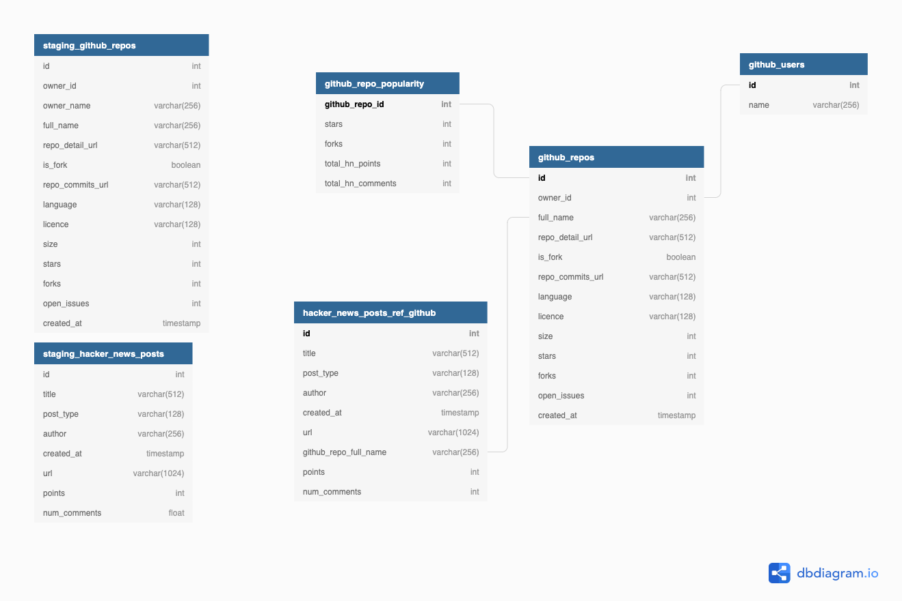
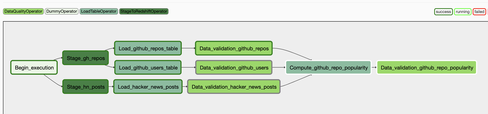

Udacity Data Engineering Capstone Project
=========================================

Project description
-------------------

The aim for this project is to pull in data from 2 different data sources:

1. List of GitHub repositories created between 29 Oct 2007 and 12 Nov 2010 - [https://www.kaggle.com/qopuir/github-repositories](https://www.kaggle.com/qopuir/github-repositories)
2. Hacker News posts (all posts since 2006) - [https://www.kaggle.com/santiagobasulto/all-hacker-news-posts-stories-askshow-hn-polls](https://www.kaggle.com/santiagobasulto/all-hacker-news-posts-stories-askshow-hn-polls)

This data will then be prepared for analysis to answer questions such as:
- Which Github repos are the most popular according to Hacker News activity?
- Which Github users are generating the most activity on Hacker News?
- Which languages are most popular?

### Data assessment

- The GitHub repo data is just for repos created between certain dates so I decided to limit the date range for which we pull in Hacker News data. There may be some established projects which are still receiving a lot of activity many years after they were created but for efficiency I decided to to limit the Hacker News posts to all posts before 2014.
- The `language`, `license`, `size`, `stars`, `forks`, `open_issues` and `created_at` columns for Github repos data are sometimes empty
- The `num_comments` column for Hacker News posts can sometimes be empty
- Some of the Hacker News URLs are very long, hence the maximum field length for this column has been set to 8192.
- To analyse Hacker News activity related to GitHub repos we need to filter rows for which the `URL` contains a GitHub URL (sometimes this `URL` is empty). This is done when loading data from the staging table into the `hacker_news_posts` dimension table using a regular expression.

### Data model



The above Entity-Relationship Diagram shows the data model used. The two staging tables are on the left and represent the data from the source CSV files with data typing applied. The tables on the right represent the dimension tables and the fact table (`github_repo_popularity`). The fact table contains metrics of popularity for GitHub repositories and is designed to help answer the questions posed above.

### ETL pipeline

The ETL (extract-transform-load) pipeline is ran via an Airflow DAG:



The DAG is comprised of a few main stages:
1. We first pull in the data from the two CSV files in S3 into two staging tables in Redshift; one for the GitHub repo data and one for the Hacker News posts.
2. Data is then loaded into the three dimension tables; GitHub repos, GitHub users, and Hacker News posts
3. Data quality checks are then performed on the data to ensure we have data in these tables and that we don't have any values that we're not expecting.
4. The fact table, `github_repo_popularity`, is then built by joining data from two of the dimension tables.
5. A final data validation check is performed on the fact table to ensure we have data.

### Choice of technologies

Airflow was chosen for this project since it allows us to build complex data pipelines in a straightforward, modular manner. One can separate the different stages of the pipeline into distinct tasks and define dependencies between them, so that some tasks can run in parallel while other tasks wait for upstream tasks before executing. It also allows us to make our initial solution scalable so that we could process data in different batches based on the timestamp of the data. The Airflow UI enables users to inspect and analyse the different steps of the pipeline and easily check if something has gone wrong.

Amazon Redshift was used as a cloud Data Warehouse because it is highly scalable. If we needed to process 100x the amount of data we currently have, Redshift would be able to handle this by allowing us to scale both the size and number of nodes in the cluster as we wish. Amazon S3 was chosen to store the CSV files since Redshift has built-in support for extracting data from S3 and it is relatively easy to set up access controls inside AWS.


## Improvements that could be made / next steps

At the moment the source data is a couple of CSV files. It would be better if we pulled in this data using the GitHub and Hacker News APIs instead so that we get up-to-date data. We could also make use of Airflow schedules so that we could pull in a subset of data for the time range given by the schedule. This would allow the project to scale if the amount of data we needed to process was increased by 100x. Some tweaks to the Redshift tables may need to be done too. For example, setting the distribution style of the dimension tables to Key would likely reduce the amount of data shuffling and improve performance.

If the pipeline was needed to run on a daily basis by 7am, I would first monitor the job to see how long the whole DAG was taking on average. I would then setup a daily schedule for the job starting at a time where I would be confident it would finish by 7am. By making use of the Airflow SLA feature we could also set up alerts if the job had not finished by 7am.

If the database were needed to be accessed by 100+ people, I would first try to understand how the users would want to query the database.
For example if I discovered that many people wanted to run similar queries, it may be possible to create some extra views of the data to make such queries more efficient, or even model the data differently. Redshift itself should have no problems handling 100+ database users, but the cluster may need scaling up. Using sensible sorting and distribution keys would also help improve performance.


Development
-----------

### Running project for first time

```bash
# Set airflow home directory
export AIRFLOW_HOME=$(pwd)/airflow
```

```bash
# Install requirements
pip install -r requirements.txt
```

```bash
# initialize the database
airflow initdb
```

```bash
# start the web server, default port is 8080
airflow webserver -p 8080
```

```bash
# start the scheduler
airflow scheduler
```

#### Add connection details via Airflow UI
AWS credentials:

Conn Id: Enter `aws_credentials`.
Conn Type: Enter `Amazon Web Services`.
Login: Enter your Access key ID
Password: Enter your Secret access key

Redshift connection details:

Conn Id: Enter `redshift`.
Conn Type: Enter `Postgres`.
Host: Enter the endpoint of your Redshift cluster, excluding the port at the end.
Schema: This is the Redshift database you want to connect to.
Login: Enter Redshift user
Password: Enter Redshift password
Port: Enter 5439.


Then visit `localhost:8080` in the browser and enable the example dag in the home page
